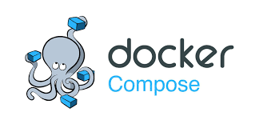
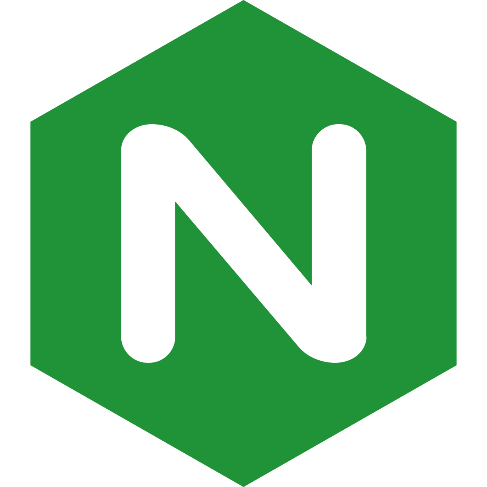

# Базовая конфигурация для запуска контейнеров при помощи Docker Compose

Основные конфигурационные файлы Docker Compose:
1. [./docker-compose.dev.yaml](DEV).
2. [./docker-compose.prod.yaml](PROD).
## MySQL

Обыкновенный MySQL с двумя volume, один из которых необходим для хранения данных бд, а другой - для заполнения бд на основе дампов.
## Nginx

Присутствует два конфигурационных файла (для DEV и PROD). Они оба заставляют Nginx проксировать запросы к /back/ как запросы для сервера на Go. Конфигурационный файл nginx определяется используемым конфигурационным файлом Docker Compose:
1. [./nginx/conf.d/dev.conf](DEV). Nginx проксирует запросы, кроме как по пути /back/, как запросы для тестового сервера на React.
2. [./nginx/conf.d/prod.conf](PROD). Nginx на всех путях, кроме /back/, обрабатывает папку build, полученную в результате билда React-приложения.
## Golang

Предусмотрен build и запуск приложения на Go во время запуска контейнера (а не его билда). Билд и запуск происходит посредством файла [./backend/start.sh](start.sh).
## React

Предусмотрен build и запуск тестового сервера React, когда используется тестовая конфигурация Docker Compose и только build в противном случае.
